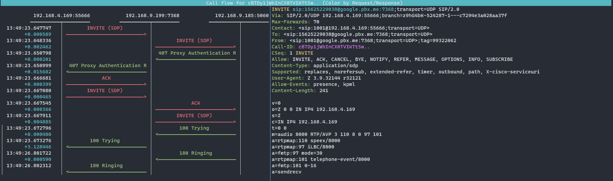

# 简介

`SIP`是一款基于golang轻量级的sip协议解析和代理的库

## 功能列表

- sip消息读取和解析
- sip消息改写和编码
- sip 信令代理
- sip 客户端库


## sip 信令代理

### 代理流程图



### docker部署

1. 编译docker镜像
```
docker build . -t siproxy
```

2. 运行容器
```
docker run -it --name siproxy -p 5060:5060 siproxy
```
